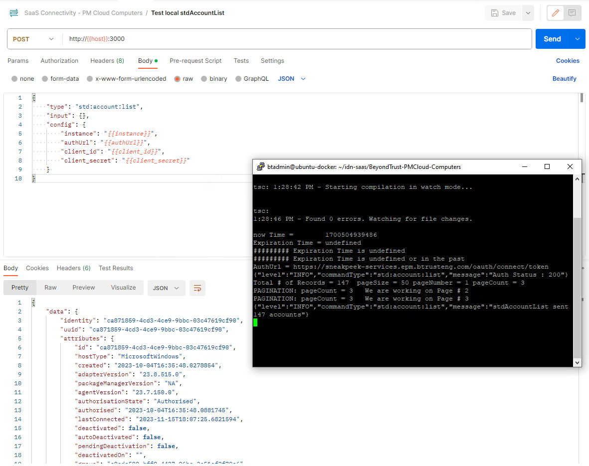

<!DOCTYPE html>
<html>
<body>

<h1>SailPoint IdentityNow SaaS Connector SDK :: BeyondTrust Computers :: Privilege Management for Windows and Mac</h1>

<h2>Computers as Accounts and Computer Groups</h2>
  
  The BeyondTrust Computers connector has been created using the <a href="https://developer.sailpoint.com/idn/docs/saas-connectivity/">SailPoint IdentityNow SaaS Connector SDK</a>.
  
<h2>Unit testing using Postman collection</h2>
   
   
  
  Test Connection
  
   
  
  Get all Computers

     
  
  Get a single Computer
  
   
  
  Get all Groups
  
   
  
  Get a Group
  
  

