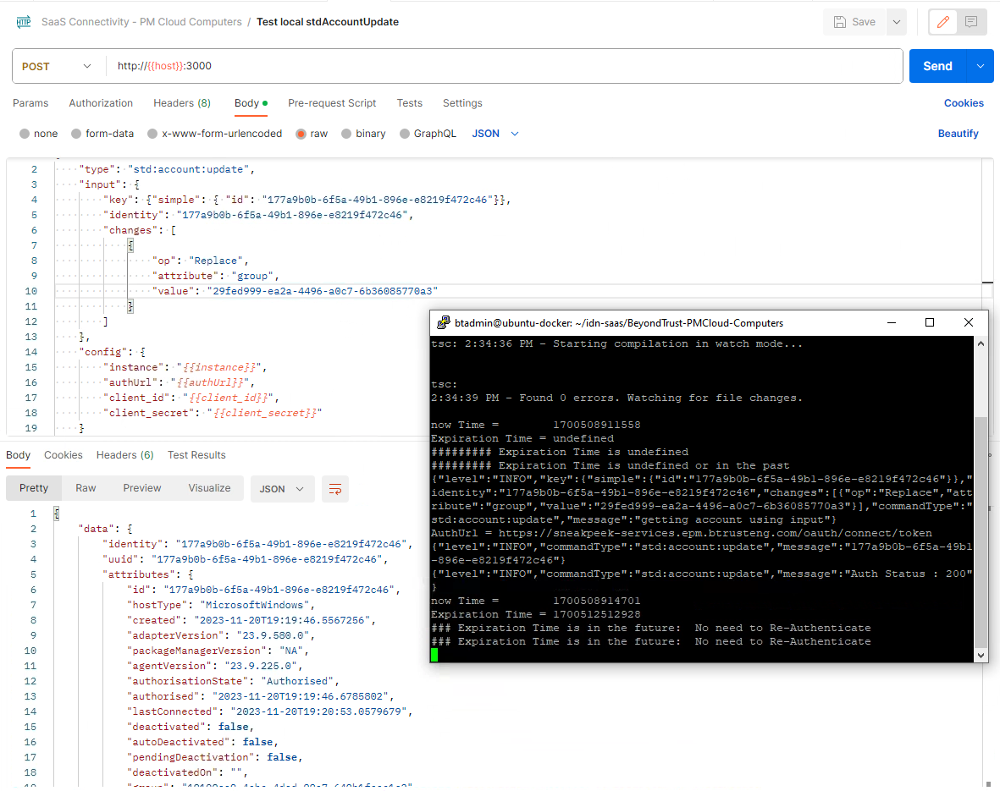

<!DOCTYPE html>
<html>
<body>

<h1>SailPoint IdentityNow SaaS Connector SDK :: BeyondTrust Computers :: Privilege Management for Windows and Mac</h1>

<h2>Computers as Accounts and Computer Groups</h2>
  
  The BeyondTrust Computers connector has been created using the <a href="https://developer.sailpoint.com/idn/docs/saas-connectivity/">SailPoint IdentityNow SaaS Connector SDK</a>.
  
<h2>Unit testing using Postman collection</h2>

  Test Connection
   
   

  
  Get all Computers

   

  
  Get a single Computer

   

  
  Get all Groups
  
   

  
  Assign Computer to Group
  
   

  Archive Computer (Disable)
  
   

  Un-Archive Computer (Enable)
  
   

  Delete Computer
  
   

  test
  
  

